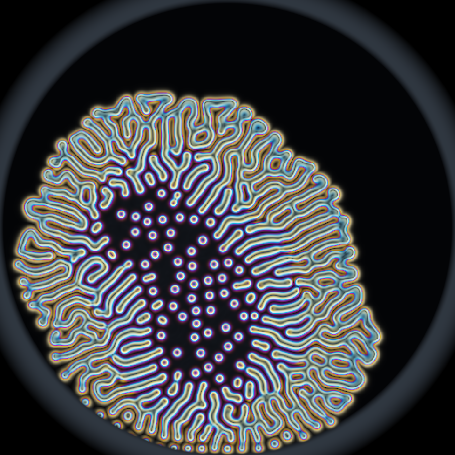

# STILL CULTURE

A living medium grows in a dish. Every instrument that would tell you what it is
doing also damages it.

You steer it toward a shape with coarse, blunt actuators — enrich the medium,
starve it, warm it, push it — while the only free information is how it moves and
the sound it makes. You can look properly whenever you like. Fluorescence will
tell you exactly what is in a region, and bleach ninety seconds of growth out of
it. Aspirate will give you precise numbers and leave a permanent hole.

At the end you are scored twice: on what the culture became, and on how much of
it you burned finding out.

The central verb is **withhold** — deciding, second by second, not to look.



*Coral strain, 300 seconds. The centre grew first, committed first, and the hidden
variant expressed there — dissolving it into discrete spots while the younger rim
is still ropy. Nothing scripted that; it fell out of the chemistry.*

## Running it

No install, no build step, no dependencies.

```bash
py tools/serve.py
```

Then open <http://127.0.0.1:8181/>. Any Python 3 and any WebGL2 browser will do.

## Controls

| Key | Tool | |
|---|---|---|
| 1 | nutrient | lowers the local kill rate — grows and thickens |
| 2 | shade | raises it — retracts a front |
| 3 | thermal | accelerates whatever is already happening |
| 4 | shear | moves mass without creating it |
| 5 | fluoresce | shows concentration exactly, and bleaches it |
| 6 | aspirate | exact numbers, permanent hole |

Left mouse applies the tool, the wheel resizes the brush, `R` starts a new dish.

## Why it is built this way

**Zero dependencies and no build step**, because Node is not installed on the
machine this was written on and never will be. That constraint turned out to be
the right one: a saved file is a running game, there is no toolchain to break, and
anyone can run it with one command. The cost — no static type checking — is paid
for with small modules and a smoke test that exercises the real simulation.

**Everything is simulated or synthesised.** There is not one art or audio asset in
this repository and there will not be. The visual identity is a Gray-Scott
reaction-diffusion system on the GPU rendered as dark-field microscopy; the audio
is a synthesised hum whose beating, roughness and register are computed from the
field's own statistics. A sound that is *computed* can be a continuous function of
game state, where a sample can only be triggered and pitched — and in this game
the audio is a load-bearing information channel rather than decoration.

## How it was designed

Twelve concepts were generated across four design lenses, then attacked by eight
adversarial critics — half hunting prior art to prove each was an existing genre
in costume, half hunting the dominant strategy a competent player finds in twenty
minutes. Three independent judges then scored the survivors.

STILL CULTURE won unanimously, 173 against 152 for the runner-up, and was the only
concept both critics on its lens declined to kill. The full record, including the
eleven rejected concepts and the arguments that killed them, is in
[`GENRE_THESIS.md`](GENRE_THESIS.md) and [`DECISION_LOG.md`](DECISION_LOG.md).

The design was then wrong three times, and measurement caught all three:

- **"Nutrient" raised the feed rate** — the intuitive mapping. It *kills* this
  culture. A response-surface sweep showed the authority is almost entirely in the
  kill rate, and steeply: −0.004 multiplies coverage fivefold, +0.004 sterilises
  the dish.
- **Parameter decay ran every tick**, giving player input a half-life of about a
  tenth of a second. The player was writing on water, and five completely
  different strategies scored within 0.01 of each other.
- **The central claim was false in the build.** A policy handed the hidden variant
  *for free* scored worse than one that ignored it. Showing the player the target
  stencil made the strain irrelevant, because the target already says what to do.
  Fixed by making the variant invert what enrichment *does*, so the same input on
  the same visible lobe helps or harms according to a fact no amount of staring at
  the target can supply.

## Does the central decision actually have teeth?

Measured, not asserted. Scripted policies against the real simulation, multiple
dishes, ten-minute sessions:

| Policy | Shape | Probes | Viability |
|---|---|---|---|
| **informed** — one probe, plays the variant | **0.254** | 1 | 0.919 |
| blind — steers well, ignores the variant | 0.220 | 0 | 1.000 |
| passive — does nothing | 0.216 | 0 | 1.000 |
| stall — waits, then commits late | 0.203 | 0 | 1.000 |
| probeHeavy — probes constantly, ignores the answers | 0.219 | 6 | 0.836 |
| **guessing** — acts on the wrong belief | **0.151** | 0 | 1.000 |

Knowing is worth **+0.034**. Being wrong costs **−0.069**. The probe is insurance
against a downside twice its upside, which is what keeps "do I look" a judgement
rather than a habit. Probing without using the answer is pure loss.

Reproduce it yourself — in the page console:

```js
const p = await import('/tests/policy.js');
GAME.loop.stop();
await p.runPolicyExperiment(GAME, { dishes: 3, duration: 600 });
```

## Honest status

**No human has played this yet.** Every number above comes from bots, and bots can
tell you a mechanic is load-bearing but not that a decision is *interesting*. The
forty-second delay between an action and its visible consequence is the largest
untested risk in the design.

Current state, known defects and the exact next action are kept in
[`PROJECT_STATE.md`](PROJECT_STATE.md), and what is wrong with the game as it
plays is kept in [`PLAYTEST_REPORT.md`](PLAYTEST_REPORT.md). Neither is a
marketing document.

## Documents

| | |
|---|---|
| [`GAME_VISION.md`](GAME_VISION.md) | player fantasy, pillars, and explicit non-goals |
| [`GENRE_THESIS.md`](GENRE_THESIS.md) | why this is not an existing genre, and the reductions that were attempted |
| [`ARCHITECTURE.md`](ARCHITECTURE.md) | subsystems, invariants, performance budgets |
| [`DECISION_LOG.md`](DECISION_LOG.md) | decisions, rejected alternatives, and why |
| [`PROJECT_STATE.md`](PROJECT_STATE.md) | where it is now and what happens next |
| [`PLAYTEST_REPORT.md`](PLAYTEST_REPORT.md) | what is wrong with it |
| [`TASK_LEDGER.md`](TASK_LEDGER.md) | prioritised work with acceptance criteria |

## Licence

Code and generated assets are original work. No third-party assets, no licensed
music, nothing reproduced from any reference game.
